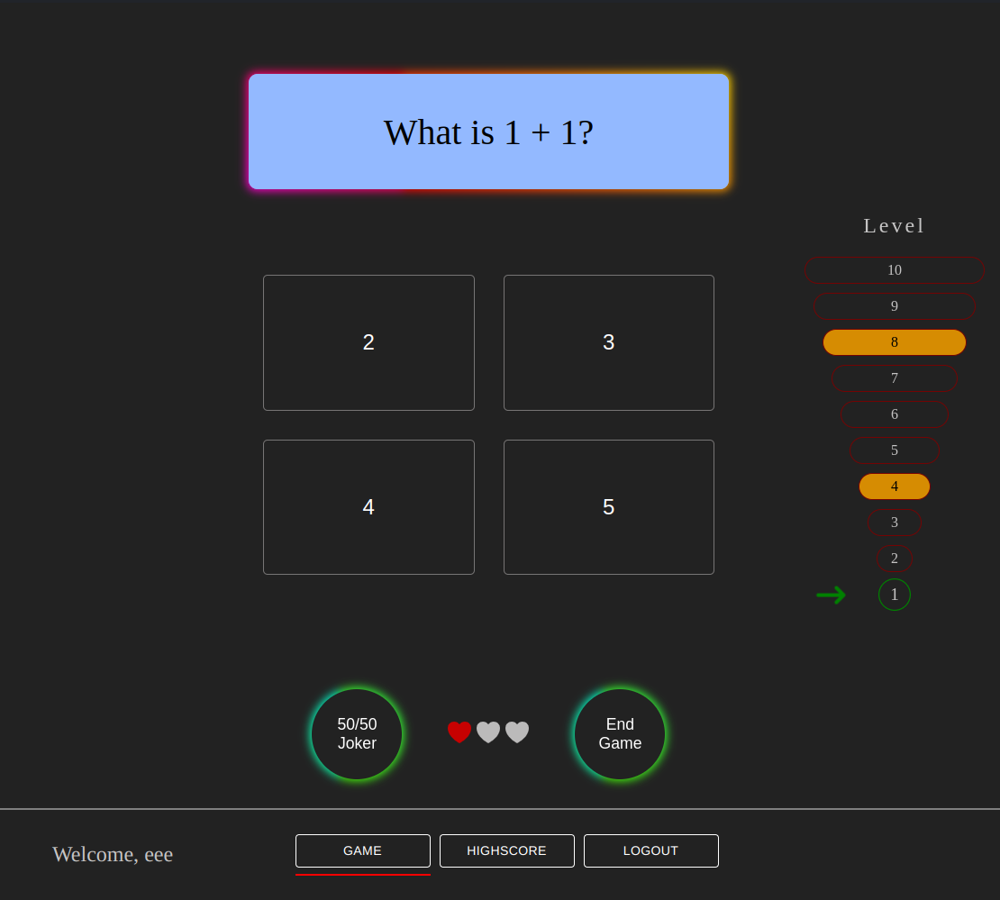
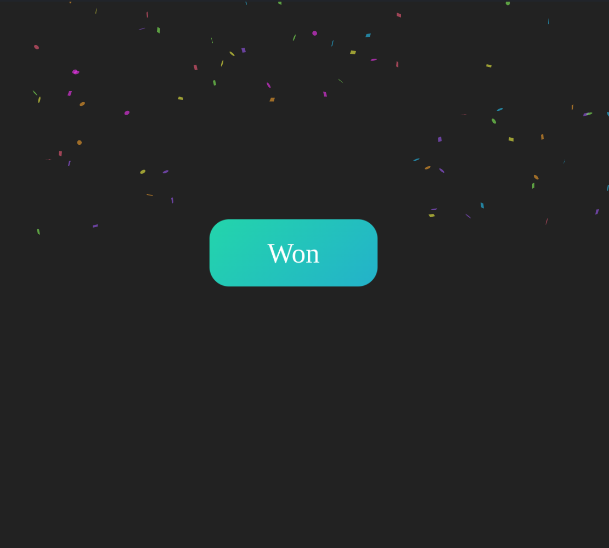
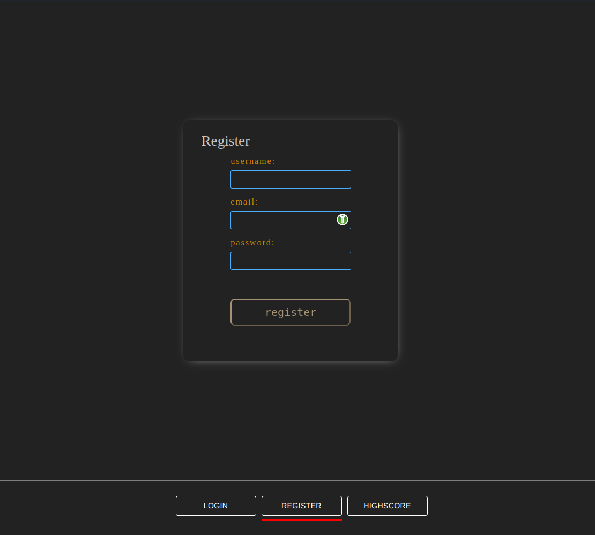

# Quiz Game App

#### (not deployed yet)

Welcome to our Question Answer Quiz Game App! This interactive platform is designed to challenge your knowledge while providing an engaging gaming experience. Whether you're a trivia enthusiast or just looking for some fun, this app has something for everyone.

Features:
Question Bank: Access a diverse range of questions across various categories and difficulties.
Livepoints: Equipped with three lives you can answer 3 questions wrong. then you're locked
for 2 hours.
Highscore: Compete against other players and climb to the top of the highcore.

Tech Stack:
Mongoose
Express
React
Socket.IO

How to Run:
Clone the repositories (QuizAppClient & QuizAppBackend) to your local machine.
Navigate to the project directory and install dependencies using "npm install".
Set up your MongoDB database connection.
Run the backend using "npm start" and navigate to the provided URL.
Run the frontend using "npm run dev".
Run the App from the Browser with the Localhost address from "Client.

Enjoy playing and challenging your friends!
Feel free to contribute to our project by submitting pull requests or reporting any issues you encounter. Let's make learning and gaming more enjoyable together!

## Impressions:

